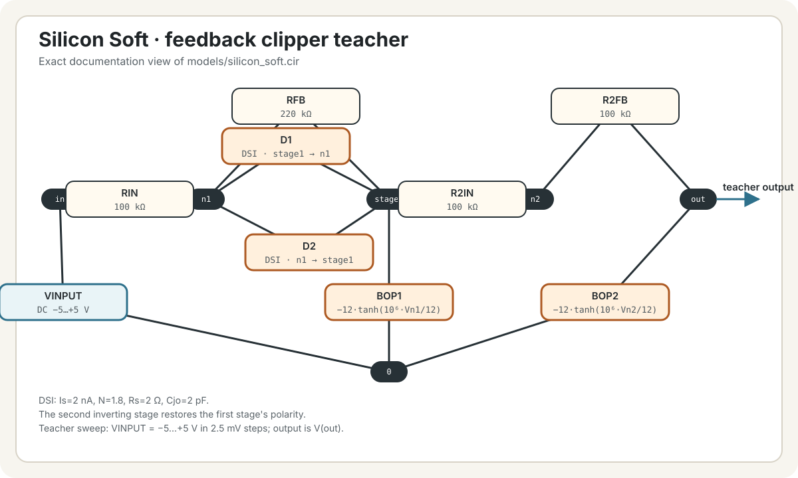
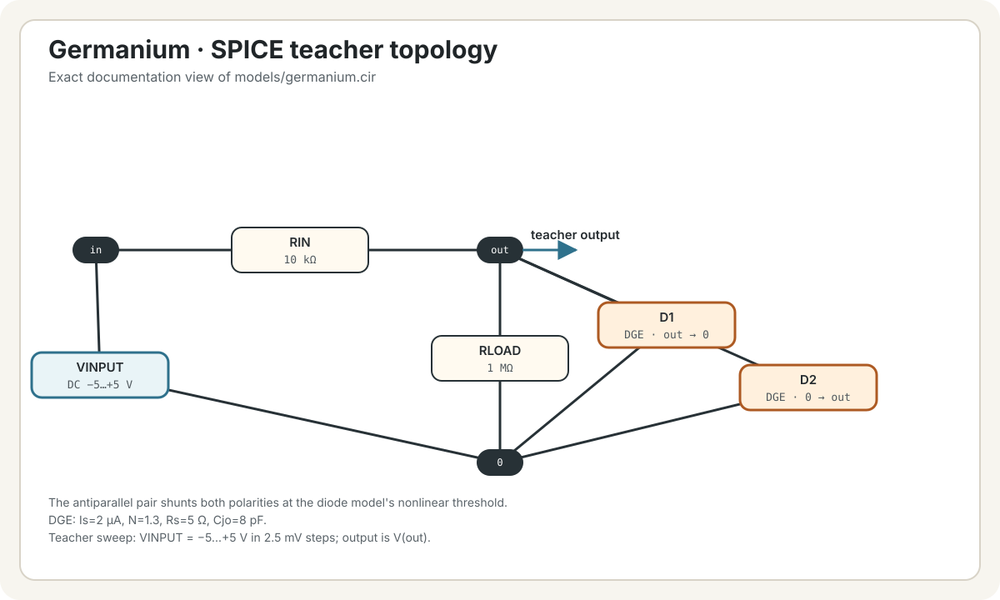
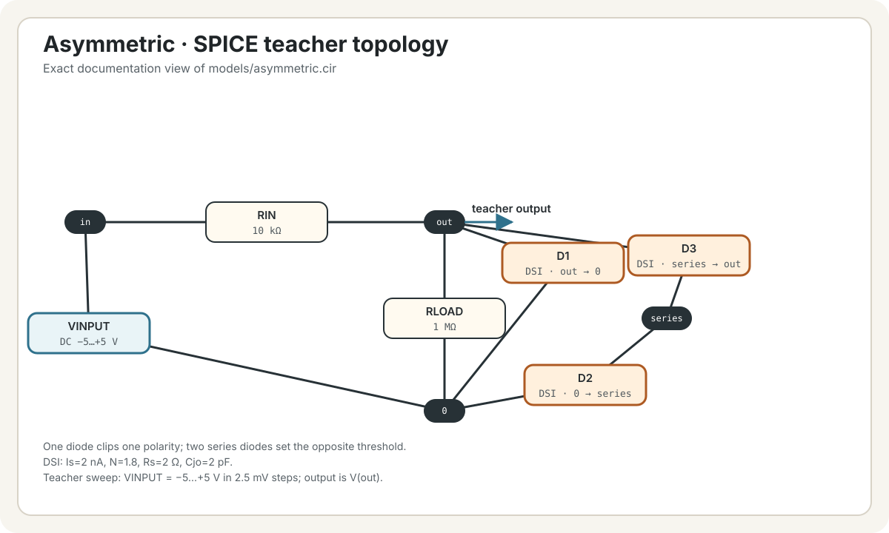
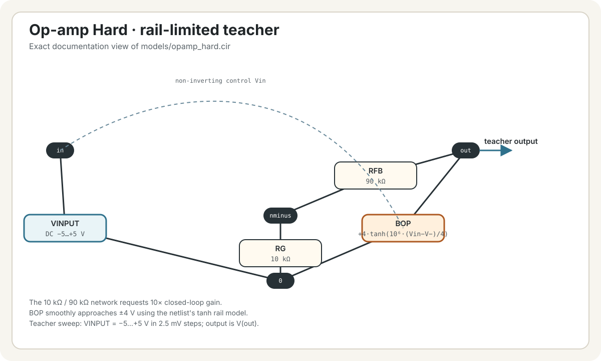
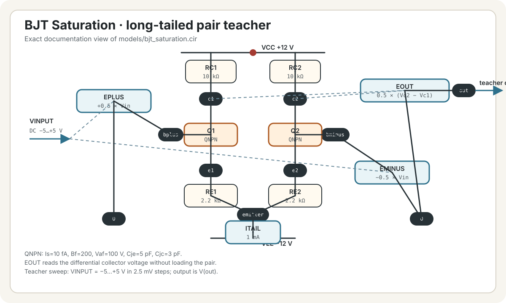
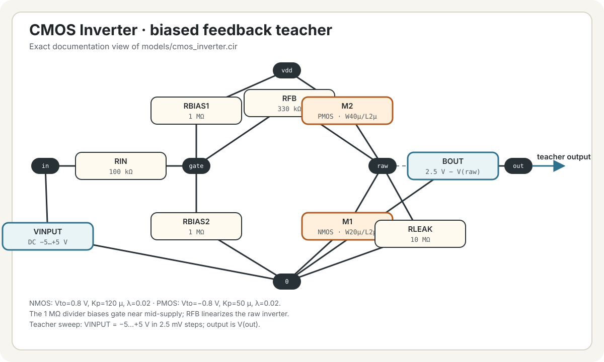
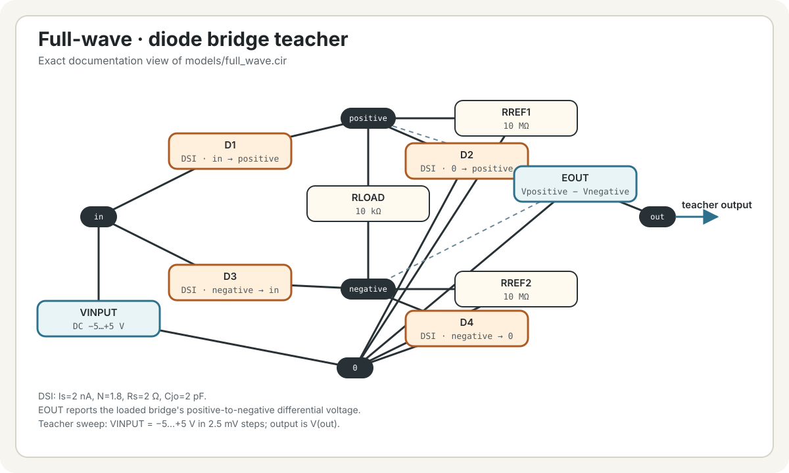

# ALN Distort

ALN Distort contains eight static circuit models learned from separate
ngspice sweeps:

- Silicon Soft
- Germanium
- LED Clip
- Asymmetric
- Op-amp Hard
- BJT Saturation
- CMOS Inverter
- Full-wave

Each transfer was learned from its own checked-in ngspice circuit under
`models/`; these are simulated electronic topologies rather than hand-authored
distortion equations.

## Circuit schematics

The SVGs below are readable topology views of the checked-in teachers. Solid
lines show circuit connections and dashed lines show behavioral-source control
signals. Each image links to the `.cir` netlist that remains the source of
truth.

<table>
  <tr>
    <td width="50%"> <strong>Silicon Soft</strong></td>
    <td width="50%"> <strong>Germanium</strong></td>
  </tr>
  <tr>
    <td width="50%"> <strong>LED Clip</strong></td>
    <td width="50%"> <strong>Asymmetric</strong></td>
  </tr>
  <tr>
    <td width="50%"> <strong>Op-amp Hard</strong></td>
    <td width="50%"> <strong>BJT Saturation</strong></td>
  </tr>
  <tr>
    <td width="50%"> <strong>CMOS Inverter</strong></td>
    <td width="50%"> <strong>Full-wave</strong></td>
  </tr>
</table>

## Controls

- **Input** — audio input bus.
- **Output** and **Output mode** — output bus and Replace/Add behavior.
- **Circuit** — selects one of the eight models; default Silicon Soft.
- **Drive** — 0-800%; default 100%. At 0% the wet transfer is identity. From
  0-100% it fades into the original learned response; above 100% it adds up to
  8x input gain before the circuit model.
- **Bias** — shifts the circuit operating point by up to +/-1 V; default 0 V.
- **Mix** — 0-100% dry/wet; default 100%.
- **Level** — 0-200%; default 100%.
- **Low-pass** — optional fixed 6 kHz one-pole output filter; default Off.

Circuit changes use a 10 ms crossfade. Each model has first-order antiderivative
antialiasing and DC rejection, so this is an audio effect rather than a
precision DC/CV waveshaper. A final limiter-safe 5 Hz DC rejector removes offset
created by asymmetric limiting while keeping the plug-in contribution within
+/-5 V. Drive 0% and Mix 0% remain transparent. In Add mode, only this plug-in's
contribution is DC-filtered and limited; other algorithms can still push the
final shared bus past that range.

The host audio test exercises the real plug-in entry point in 128-sample blocks.
It settles and captures every circuit at 30 Hz, 100 Hz, and 1 kHz across five
Drive points from 25% to 800% and all three Bias extremes. It also covers 50%
Mix, 200% Level, both bypass paths, low-pass, and Add routing. The generated CSV
records DC, RMS, peak, fundamental, residual, and THD+N measurements for
comparison between revisions.

The plug-in requires disting NT firmware 1.15 or later. Install
`aln_distortion_bank.o` under `/programs/plug-ins/`; it appears as **ALN
Distort**.
