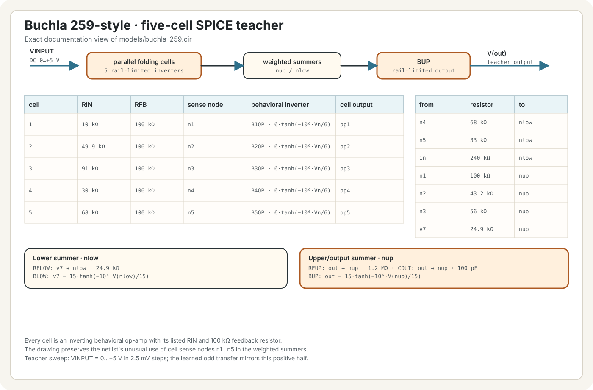
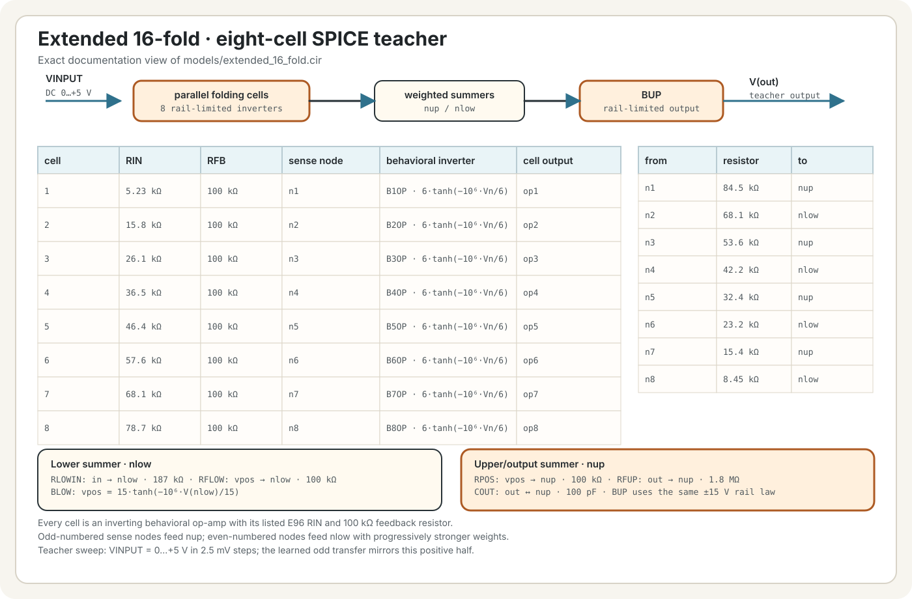

# ALN Fold

ALN Fold has two selectable transfer curves: a Buchla 259-style
five-cell circuit model and an extended eight-cell model. The first produces
eight turning points across a -5 V to +5 V sweep; the second produces sixteen.

At Fold 0%, the signal is unchanged before Mix and the optional output filter.
At Fold 100%, a 10 Vpp input covers the complete learned circuit range. Both
models are normalized to approximately 10 Vpp output. Switching models uses a
10 ms crossfade.

Both transfers were learned from the checked-in ngspice teachers under
`models/`; they are not hand-authored waveshaping equations.

## Circuit schematics

These SVGs document the actual circuit topologies and values used for the
training sweeps. The linked `.cir` netlists remain the source of truth; click a
diagram to inspect one.

### Buchla 259-style

### Extended 16-fold

## Controls

- **Input** — audio input bus.
- **Output** and **Output mode** — output bus and Replace/Add behavior.
- **Fold** — 0-100%; default 100%. Moves continuously from identity to the full
  learned response.
- **Mix** — 0-100% dry/wet; default 100%.
- **Low-pass** — optional fixed 1,326 Hz one-pole output filter; default Off.
- **Model** — Buchla 259 or 16-fold; default 16-fold.

Input is limited to the learned -5 V to +5 V domain on the wet path. Fold is
smoothed, model changes are crossfaded, and the folded branch uses first-order
antiderivative antialiasing.

The plug-in requires disting NT firmware 1.15 or later. Install
`aln_fold_wavefolder.o` under `/programs/plug-ins/`; it appears as **ALN Fold**.
